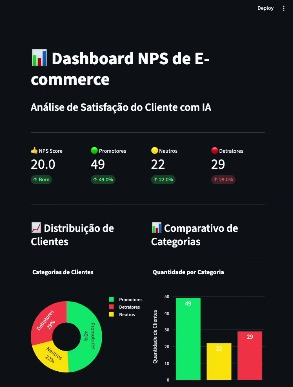

# 📊 E-commerce NPS Project

Sistema completo de análise de NPS (Net Promoter Score) para e-commerce utilizando análise de sentimento com IA via Ollama.

## 🏗️ Arquitetura

- **Backend**: FastAPI + SQLAlchemy (SQLite)
- **Frontend**: Streamlit
- **IA**: Ollama (análise de sentimento com LLM)
- **Visualização**: Plotly

## 📁 Estrutura do Projeto (Simplificada)

```
ecommerce_nps/
├── data/
│   └── ecommerce_nps.db          # Banco de dados SQLite (gerado automaticamente)
├── backend.py                    # API FastAPI com integração Ollama
├── fake_data.py                  # Script para gerar 1000 avaliações fake
├── frontend.py                   # Dashboard Streamlit
├── requirements.txt              # Dependências do projeto
└── README.md                     # Este arquivo
```

## 🚀 Instalação e Configuração

### 1. Instalar Dependências Python

```bash
cd ecommerce_nps
pip install -r requirements.txt
```

### 2. Instalar e Configurar Ollama

#### Instalar Ollama

**Linux:**
```bash
curl -fsSL https://ollama.com/install.sh | sh
```

**macOS:**
```bash
brew install ollama
```

**Windows:**
Baixe o instalador em: https://ollama.com/download

#### Iniciar o Serviço Ollama

```bash
ollama serve
```

O Ollama rodará em `http://localhost:11434`

#### Baixar o Modelo de IA

Em outro terminal, execute:

```bash
ollama pull gemma:2b
```

> **Nota**: O modelo `gemma:2b` é recomendado por ser mais rápido (~2-3x) e menor (~1.7GB), ideal para análise de sentimento.

**Modelos alternativos** (caso queira testar outros):
- `ollama pull phi3` (mais preciso, mas mais lento)
- `ollama pull llama2` (mais robusto, porém pesado)
- `ollama pull mistral` (boa alternativa rápida)

### 3. Popular o Banco de Dados

Execute o script para gerar 100 avaliações fake:

```bash
python fake_data.py
```

Você verá uma mensagem de confirmação:
```
✅ Banco populado com sucesso! Total: 100 avaliações.
```

## ▶️ Executando o Projeto

### 1. Iniciar o Backend (FastAPI)

```bash
uvicorn backend:app --reload
```

A API estará disponível em: `http://localhost:8000`

Documentação interativa: `http://localhost:8000/docs`

### 2. Iniciar o Frontend (Streamlit)

Em outro terminal:

```bash
streamlit run frontend.py
```


O dashboard abrirá automaticamente em: `http://localhost:8501`

## 📊 Como Usar

### Passo 1: Processar Avaliações com IA

1. Acesse o dashboard Streamlit
2. Na barra lateral, clique em **"🤖 Rodar Análise de Sentimento (Ollama)"**
3. Aguarde o processamento (pode levar alguns minutos para 100 avaliações)
4. O dashboard será atualizado automaticamente

### Passo 2: Visualizar o NPS

Após o processamento, você verá:

- **NPS Score**: Métrica principal (% Promotores - % Detratores)
- **Distribuição**: Quantidade de Promotores, Neutros e Detratores
- **Gráficos**: 
  - Gráfico de pizza com distribuição percentual
  - Gráfico de barras comparativo
- **Tabela**: Avaliações detalhadas com filtros

### Passo 3: Filtrar e Analisar

- Use os filtros para visualizar categorias específicas
- Ajuste o número de linhas exibidas
- Ordene por nota para identificar melhores/piores avaliações

## 🔌 Endpoints da API

### `GET /api/avaliacoes`
Retorna todas as avaliações do banco.

### `GET /api/nps`
Calcula e retorna o NPS com estatísticas detalhadas.

**Resposta:**
```json
{
  "nps_score": 15.5,
  "total_avaliacoes": 100,
  "promotores": 350,
  "neutros": 300,
  "detratores": 350,
  "percentual_promotores": 35.0,
  "percentual_neutros": 30.0,
  "percentual_detratores": 35.0
}
```

### `POST /api/processar_avaliacoes`
Processa todas as avaliações pendentes usando Ollama.

**Resposta:**
```json
{
  "total_processadas": 100,
  "total_pendentes": 100
}
```

## 📈 Entendendo o NPS

### Categorias de Clientes

- **🟢 Promotores (8-10)**: Clientes entusiastas que recomendam ativamente
- **🟡 Neutros (5-7)**: Clientes satisfeitos mas não entusiastas
- **🔴 Detratores (0-4)**: Clientes insatisfeitos que podem prejudicar a marca

### Fórmula do NPS

```
NPS = % Promotores - % Detratores
```

### Interpretação

- **NPS > 50**: Excelente! 🎉
- **NPS 0-50**: Bom 👍
- **NPS < 0**: Precisa melhorar ⚠️

## 🛠️ Troubleshooting

### Erro: "Serviço Ollama indisponível"

**Solução**: Certifique-se de que o Ollama está rodando:
```bash
ollama serve
```

### Erro: "Model not found"

**Solução**: Baixe o modelo:
```bash
ollama pull gemma:2b
```

### Processamento muito lento

**Soluções**:
1. Certifique-se de estar usando o modelo otimizado `gemma:2b` (mais rápido)
2. Se ainda estiver lento, tente um modelo ainda menor (não recomendado para qualidade)
3. Use uma GPU se disponível (Ollama detecta automaticamente)

### Banco de dados não encontrado

**Solução**: Execute o script de população:
```bash
python fake_data.py
```

## 🔧 Personalização

### Trocar o Modelo de IA

No arquivo `backend.py`, linha 65, altere:

```python
def get_ollama_sentiment_score(texto: str, model: str = "gemma:2b"):
```

Para outro modelo de sua preferência:

```python
def get_ollama_sentiment_score(texto: str, model: str = "phi3"):  # Mais preciso
# ou
def get_ollama_sentiment_score(texto: str, model: str = "llama2"):  # Mais robusto
```

**Lembre-se**: Modelos maiores são mais precisos, mas mais lentos.

### Ajustar o Prompt de Análise

Edite o prompt na função `get_ollama_sentiment_score()` em `backend.py` para personalizar a análise.

### Adicionar Mais Avaliações

No arquivo `fake_data.py`, altere a linha final:

```python
popular_banco(100)  # Altere para o número desejado
```

## 📝 Licença

Este projeto é de código aberto e está disponível para uso educacional e comercial.

## 🤝 Contribuições

Contribuições são bem-vindas! Sinta-se à vontade para abrir issues ou pull requests.

## 📧 Suporte

Para dúvidas ou problemas, abra uma issue no repositório do projeto.

---

**Desenvolvido com ❤️ por https://github.com/albertohco usando FastAPI, Streamlit e Ollama**
